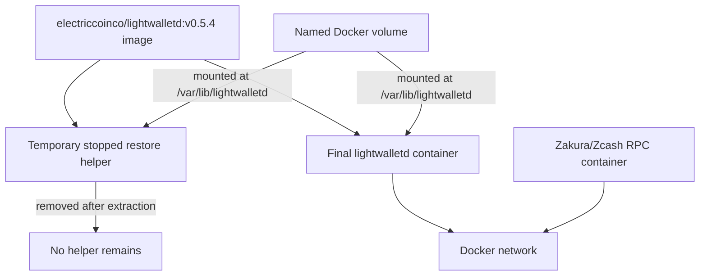

# How lightwalletd snapshots work

This document explains the design and behavior of the snapshot system in this
repository. It covers what is saved, why restoring it accelerates startup, how
consistency is maintained, how Docker is used during restoration, and how the
daily GitHub Actions job publishes artifacts to Amazon S3.

## 1. What problem the snapshot solves

A fresh `lightwalletd` does not initially have its compact-block cache. It must query a synchronized Zakura/Zcash node, process the historical chain, and populate its local database from the beginning. That can take substantial time and compute.

A synchronized `lightwalletd` has already performed this work. Its data directory contains the compact-block cache required to serve light-wallet clients. The v0 prototype copies that data directory into a compressed archive.

When another instance restores the archive, it starts with the historical cache already populated. It only needs to:

1. Read the restored cache from disk.
2. Ask its backing Zakura/Zcash node for blocks created after the snapshot.
3. Process that relatively small difference.
4. Wait at the current chain tip.

The full node is not included in the snapshot. A restored `lightwalletd` still requires access to an independently synchronized and correctly configured Zakura/Zcash RPC server.

## 2. High-level data flow

```mermaid
flowchart TD
    Z1[Synced Zakura/Zcash node] -->|RPC| L1[Synced source lightwalletd]
    L1 -->|writes cache| D1[/var/lib/lightwalletd]
    D1 -->|docker cp tar stream| T[tar stream]
    T -->|zstd compression| A[snapshot.tar.zst]
    A --> H[SHA-256 sidecar]
    A -->|local file or HTTP| R[Restore script]
    H --> R
    R -->|zstd decompression| T2[tar stream]
    T2 -->|docker cp extraction| V[New Docker volume]
    V --> L2[Restored lightwalletd]
    Z2[Synced Zakura/Zcash node] -->|RPC catch-up| L2
```

The two user-facing programs are:

- [`scripts/create-snapshot.sh`](../scripts/create-snapshot.sh): converts a synchronized data directory into an archive.
- [`scripts/start-from-snapshot.sh`](../scripts/start-from-snapshot.sh): converts that archive into a running Docker container and volume.

## 3. What is inside a snapshot

The source container stores its data under:

```text
/var/lib/lightwalletd
```

For the tested mainnet deployment, the significant files are:

```text
/var/lib/lightwalletd/
  db/
    main/
      blocks
      lengths
```

The snapshot archives the contents of `/var/lib/lightwalletd`, not the container itself. It does not include:

- The `lightwalletd` Docker image.
- The Zakura/Zcash full-node blockchain database.
- Docker networks or container configuration.
- RPC credentials.
- TLS certificates.
- Application logs.
- Wallet seed phrases or private keys.

The archive is therefore a prebuilt `lightwalletd` cache, not a complete deployment image.

## 4. Snapshot artifact set

A successful creation produces three adjacent files:

```text
lightwalletd-mainnet-v0.5.4-TIMESTAMP.tar.zst
lightwalletd-mainnet-v0.5.4-TIMESTAMP.tar.zst.sha256
lightwalletd-mainnet-v0.5.4-TIMESTAMP.tar.zst.info
```

### `.tar.zst`

The database directory encoded as a tar stream and compressed with Zstandard.

Tar preserves the directory hierarchy expected under `/var/lib/lightwalletd`. Zstandard was selected because it offers fast decompression and reasonable compression, which is useful when the main objective is reducing restore time.

The default compression level is `3`, and `-T0` allows Zstandard to use available CPU threads.

### `.sha256`

A SHA-256 checksum generated after archive creation. It detects accidental corruption or incomplete transfers.

It does not prove who created the archive. If an attacker can replace both the archive and its `.sha256` file, checksum validation alone will not detect that attack. Users must obtain v0 snapshots from a trusted source.

### `.info`

Human-readable metadata containing:

- Prototype format version.
- Blockchain network.
- UTC creation timestamp.
- Source container name.
- Source Docker image tag.
- Source data directory.
- Archive name and human-readable size.
- Last observed `Waiting for block` log entry, when available.

The `.info` file is descriptive only. The restore script does not currently parse it or use it to enforce compatibility.

## 5. Creation lifecycle

The creation command is:

```bash
./scripts/create-snapshot.sh [output-directory]
```

Defaults:

```text
CONTAINER_NAME=lightwalletd
DATA_DIR=/var/lib/lightwalletd
EXPECTED_IMAGE=electriccoinco/lightwalletd:v0.5.4
COMPRESSION_LEVEL=3
output directory=./snapshots
```

### Step 1: dependency checks

The script requires:

- `docker`
- `zstd`
- `sha256sum`
- `date`

It exits before changing the source container if a required command is unavailable.

The script uses Bash strict mode:

```bash
set -Eeuo pipefail
```

This makes unset variables, failed commands, and failed commands within pipelines terminate the operation rather than silently producing a questionable artifact.

### Step 2: source checks

The script confirms that:

1. The configured source container exists.
2. The source container is running.
3. Its configured image tag exactly equals `EXPECTED_IMAGE`.

The default image requirement is:

```text
electriccoinco/lightwalletd:v0.5.4
```

This exact check reduces the risk of creating a snapshot with one database format and restoring it with an incompatible binary. The check uses the configured image tag, not the immutable image digest; stricter compatibility verification is deferred beyond v0.

### Step 3: filename and partial file

The archive name includes a UTC timestamp:

```text
lightwalletd-mainnet-v0.5.4-20260822T172029Z.tar.zst
```

Compression writes to a temporary name similar to:

```text
snapshot.tar.zst.partial.12345
```

The temporary file is renamed to the final archive only after compression completes and the source container has restarted. A failed or interrupted operation therefore does not leave a partial file that looks like a complete snapshot.

### Step 4: capture the apparent source tip

Before stopping the container, the script scans its last 500 log lines and records the newest line containing:

```text
Waiting for block:
```

For example:

```text
Waiting for block: 3456961
```

If `lightwalletd` is waiting for block `N`, it has generally processed through block `N - 1`. This log value is useful operational evidence, but v0 does not use a gRPC call or node RPC query to prove the exact snapshot height.

### Step 5: quiesce the source for consistency

For an ordinary persistent container, the script runs:

```bash
docker stop lightwalletd
```

For a supervised container that may be removed or recreated when stopped, set
`QUIESCE_MODE=pause`; the script then uses `docker pause` and `docker unpause`.
The deployed daily workflow uses pause mode.

This is the central consistency mechanism.

Database files can be internally inconsistent if copied while the process is
modifying them. Stopping or pausing the container ensures no `lightwalletd`
writer changes `/var/lib/lightwalletd` while Docker reads it.

The tradeoff is source downtime for the duration of the archive stream. In the tested environment:

- Source data size was approximately 29 GB.
- Compressed size was approximately 23 GB.
- Source downtime was approximately 80 seconds.

Performance depends on disk speed, CPU, data size, and compressibility.

### Step 6: guarantee resume on failure

Before quiescing the source, the script records that a resume is required. An
`EXIT` trap checks this state.

If compression fails, the shell receives `SIGINT`, the shell receives `SIGTERM`, or another checked command fails, cleanup:

1. Deletes the partial archive.
2. Attempts to start or unpause the source container.
3. Returns the original failure status.

This reduces the chance that an interrupted snapshot operation leaves production stopped. Operators should still monitor the source after running the script because no shell trap can guarantee recovery from host power loss, kernel failure, or `SIGKILL`.

### Step 7: archive and compress

The core pipeline is:

```bash
docker cp "$CONTAINER_NAME:$DATA_DIR/." - \
  | zstd -T0 -3 -o snapshot.tar.zst.partial
```

`docker cp` writes a tar archive to standard output when its local destination is `-`. Zstandard reads that stream and writes the compressed archive.

This streaming design avoids creating both an uncompressed 29 GB tar file and a compressed 23 GB archive on disk. Only the compressed output is retained.

Because `pipefail` is enabled, a failure in either `docker cp` or `zstd` fails the complete operation.

### Step 8: resume production

After a non-empty compressed archive exists, the script starts or unpauses the
source container and waits up to 30 seconds for Docker to report it as running.

This confirms container process state, not full gRPC readiness or successful resynchronization. Operators should inspect the source logs after creation:

```bash
docker logs --tail 20 lightwalletd
```

### Step 9: finalize and hash

After source restart:

1. The partial archive is renamed to its final filename.
2. `sha256sum` creates the checksum sidecar.
3. The `.info` metadata file is written.
4. All three files are assigned mode `0644` so an ordinary static web server can read them.

Hashing occurs after production restarts, so checksum calculation does not add source downtime.

## 6. Why the restored server fast-syncs

The restored volume already contains the source's block cache. At startup, `lightwalletd` reads the cache and discovers its highest cached block instead of constructing the cache from genesis.

The successful remote test showed:

```text
Reading 3456961 blocks from the cache ...
Done reading 3456961 blocks from disk cache
Waiting for block: 3456966
Waiting for block: 3456967
```

The source snapshot contained 3,456,961 cached blocks. The backing node had advanced by a few blocks while the archive was created and restored. The restored process fetched only those newer blocks and then waited at the same tip as production.

The snapshot does not need to represent the newest block at restore time. It only needs to be internally consistent and reasonably recent; normal `lightwalletd` synchronization handles the remaining gap.

## 7. Restore lifecycle

The restore command is:

```bash
./scripts/start-from-snapshot.sh <snapshot-path-or-url>
```

Defaults:

```text
CONTAINER_NAME=lightwalletd
VOLUME_NAME=lightwalletd-data
IMAGE=electriccoinco/lightwalletd:v0.5.4
DATA_DIR=/var/lib/lightwalletd
GRPC_PORT=9067
RPC_PORT=8232
RPC_USER=lightwalletd
START_TIMEOUT=60
FORCE=0
```

Required configuration:

- `RPC_HOST`
- `RPC_PASSWORD`

`DOCKER_NETWORK` is needed when `RPC_HOST` is the DNS name of another container on a user-defined Docker network.

### Step 1: protect existing data

Before downloading or extracting anything, the script checks whether the target container or volume already exists.

By default, it exits rather than overwriting either one. This prevents an accidental restore from deleting an existing deployment.

For parallel testing, use separate values:

```text
CONTAINER_NAME=lightwalletd-snapshot-test
VOLUME_NAME=lightwalletd-snapshot-test-data
GRPC_PORT=19067
```

`FORCE=1` removes the existing target container and volume. This is intentionally destructive and should not be used casually.

### Step 2: acquire the archive

For a local path, the script uses the file in place and looks for:

```text
<archive-path>.sha256
```

For an HTTP or HTTPS URL, the script downloads the archive into a temporary directory with:

```bash
curl --fail --location --retry 3
```

It then requests the checksum from:

```text
<snapshot-url>.sha256
```

The download currently does not use `curl --continue-at`, so an interrupted v0 download starts over on the next run. Resumable downloading is a future improvement.

If an HTTP checksum sidecar is unavailable, v0 prints a warning and continues. For a trusted operational workflow, always publish and require the checksum sidecar.

### Step 3: verify integrity

When the sidecar is present, the script:

1. Reads the first whitespace-delimited field.
2. Verifies it has exactly 64 hexadecimal characters.
3. Calculates the archive's SHA-256.
4. Compares hashes case-insensitively.

It then independently runs:

```bash
zstd --test --quiet snapshot.tar.zst
```

The SHA-256 check detects byte-level changes. The Zstandard test confirms that the complete compressed frame can be decoded.

Neither check proves that the archive contains a valid `lightwalletd` database; structural checks occur after extraction, and complete database validity is ultimately demonstrated by starting `lightwalletd`.

### Step 4: create an isolated Docker volume

The script creates:

```bash
docker volume create "$VOLUME_NAME"
```

This volume becomes the restored instance's persistent `/var/lib/lightwalletd` directory.

Restoring into a new volume has two benefits:

- Existing host directories are not overwritten during extraction.
- Failed restores can be removed cleanly by deleting the new volume.

### Step 5: create a stopped restore helper

The script creates a temporary stopped container from the target `lightwalletd` image and mounts the new volume at `/var/lib/lightwalletd`.

Conceptually:

```bash
docker create \
  --name lightwalletd-restore-PID \
  --volume lightwalletd-data:/var/lib/lightwalletd \
  electriccoinco/lightwalletd:v0.5.4
```

The helper does not run `lightwalletd`. Its purpose is to give `docker cp` a container path backed by the target Docker volume.

This avoids needing to locate Docker's internal volume path on the host and avoids relying on an additional utility image.

### Step 6: decompress directly into the volume

The core restore pipeline is:

```bash
zstd --decompress --stdout snapshot.tar.zst \
  | docker cp - restore-helper:/var/lib/lightwalletd
```

Zstandard emits the original tar stream. `docker cp` reads tar data from standard input and extracts it into the helper container's mounted data directory. Because that directory is backed by the new named volume, the files persist after the helper is removed.

The archive is not first expanded into a second host-side directory. This reduces temporary disk requirements.

After extraction, the helper container is removed.

### Step 7: structural database check

The script mounts the restored volume into a temporary process and verifies these files exist:

```text
/var/lib/lightwalletd/db/main/blocks
/var/lib/lightwalletd/db/main/lengths
```

If either is missing, restoration fails and cleanup removes the new volume.

This check deliberately fixes v0 to mainnet and the observed v0.5.4 directory structure.

### Step 8: start the restored container

The script builds a Docker argument array and starts the target image with:

- Restart policy `unless-stopped`.
- The restored volume mounted at `/var/lib/lightwalletd`.
- Container gRPC port `9067` published on the configured host port.
- Optional user-defined Docker network.
- Backing-node RPC host, port, username, and password.
- Plaintext gRPC through `--no-tls-very-insecure`.
- Logs directed to container standard output.

The argument-array construction avoids shell evaluation of a dynamically generated command string.

The resulting command is equivalent to:

```bash
docker run -d \
  --name lightwalletd \
  --restart unless-stopped \
  --network zakura_default \
  -p 9067:9067 \
  -v lightwalletd-data:/var/lib/lightwalletd \
  electriccoinco/lightwalletd:v0.5.4 \
  --no-tls-very-insecure \
  --grpc-bind-addr=0.0.0.0:9067 \
  --http-bind-addr=0.0.0.0:9068 \
  --rpchost=zakura \
  --rpcport=8232 \
  --rpcuser=lightwalletd \
  --rpcpassword=REDACTED \
  --data-dir=/var/lib/lightwalletd \
  --log-file=/dev/stdout \
  --log-level=6
```

The RPC password is part of the container command and can be visible through Docker inspection. That matches the current v0 deployment style but should be replaced with a safer credential mechanism in a production design.

### Step 9: readiness check

For up to `START_TIMEOUT` seconds, the script checks:

1. The container remains in Docker's running state.
2. The configured host gRPC port accepts a TCP connection.

If the container exits or the port never opens, the script prints recent logs and fails.

A reachable TCP port means the listener opened; it is not a complete gRPC application-level health check. Operators should confirm the cache and tip through logs.

### Step 10: preserve success or clean up failure

The restore script tracks whether it created the volume and final container.

Before successful readiness:

- A failed operation removes the newly created container.
- A failed operation removes the newly created volume.
- The temporary download directory is removed.

After successful readiness:

- The final container and volume are retained.
- Temporary downloaded files are removed.
- Recent logs and the follow command are printed.

For a local source path, the original snapshot is never removed.

## 8. Docker resource model



The restored test does not create a second copy of the Docker image if the same image is already present. Docker reuses the existing image layers. The large additional resource is the named volume containing the restored database.

To remove an isolated test completely:

```bash
docker rm -f lightwalletd-snapshot-test
docker volume rm lightwalletd-snapshot-test-data
```

Deleting only the container does not delete the named volume. The volume must be removed explicitly to reclaim database space.

## 9. Disk-space behavior

For the tested snapshot:

- Source database: approximately 29 GB.
- Compressed archive: approximately 23 GB.
- Restored Docker volume: approximately 29 GB.

### Local-file restore on the snapshot host

Peak additional space is primarily the restored volume because the script reads the archive in place:

```text
existing archive + restored volume
23 GB + 29 GB
```

### HTTP restore

The script first downloads the archive to a temporary directory and then restores it. During restoration, the destination may temporarily hold:

```text
downloaded archive + restored volume
23 GB + 29 GB
```

If the server already stores another copy of the archive, include that in capacity planning.

The temporary HTTP download is deleted after success or failure.

## 10. How to prove fast sync worked

Do not rely only on the script's “started successfully” message. Inspect the restored logs:

```bash
docker logs --tail 50 lightwalletd-snapshot-test
```

Look for this sequence:

```text
Reading N blocks from the cache ...
Done reading N blocks from disk cache
Starting gRPC server on 0.0.0.0:9067
Waiting for block: M
```

Interpretation:

- A large `N` proves the restored historical cache was loaded.
- A `Waiting for block` value near the backing node tip proves it did not restart from genesis.
- Matching “Waiting for block” values between production and the restored instance prove both have reached the same backing-node tip.

Useful comparisons:

```bash
docker logs --tail 10 lightwalletd
docker logs --tail 10 lightwalletd-snapshot-test
```

Container state:

```bash
docker inspect lightwalletd-snapshot-test \
  --format 'running={{.State.Running}} restarting={{.State.Restarting}} exit={{.State.ExitCode}}'
```

Port state:

```bash
ss -lnt | grep ':19067'
```

## 11. Tested behavior

### Automated AWS publication test

On 2026-09-30, GitHub Actions run `36722157151` executed on the EC2 source host
and published a `v0.5.4` snapshot to the private S3 bucket:

- Source cache: approximately 25 GB.
- Compressed archive: 17,311,387,039 bytes (approximately 17 GB).
- Source pause: 13:30:49Z through 13:35:50Z.
- S3 multipart upload: 13:41:04Z through 13:43:27Z.
- SHA-256: `4ebc4e7da55b149393ba52519ad4fc7292534e81a9e9e137bec1ec90b7cc4645`.
- The archive, checksum, info file, and `latest.json` were verified in S3.
- The local archive was removed only after successful publication.
- The production container was confirmed running and unpaused afterward.

The earlier prototype evidence below predates the AWS automation.

The prototype was exercised entirely on the remote Docker host, not on the development workstation.

### Snapshot creation test

- Source image: `electriccoinco/lightwalletd:v0.5.3`.
- Source database: approximately 29 GB.
- Archive: approximately 23 GB.
- Source cache at creation: 3,456,961 blocks.
- Source restarted successfully after approximately 80 seconds of archive downtime.
- Archive SHA-256:

```text
31eaa2342489c11907b576bf977b6e1cdbc78dd15c93d63de91cf3e67418bc50
```

### Local-path restore test

The archive was restored into an isolated test volume and container. The restored instance loaded 3,456,961 cached blocks, caught up to the backing node, and waited for block 3,456,967 alongside production.

### HTTP restore test

The same 23 GB artifact was served through a temporary loopback HTTP server. The script downloaded the full archive and checksum, verified both, restored another isolated volume, and started successfully. The restored process loaded the same cache and caught up to block 3,456,974 before waiting for 3,456,975, matching production.

All temporary test containers, test volumes, and the temporary HTTP service were removed after validation. The production container remained running.

## 12. Consistency and integrity guarantees

### What v0 guarantees

- The source `lightwalletd` process is stopped or paused while the archive stream is produced.
- A failed pipeline does not publish the temporary file under the final archive name.
- Cleanup attempts to start or unpause a source quiesced by the script.
- SHA-256 detects accidental artifact changes when the sidecar is present and trusted.
- Zstandard integrity is tested before extraction.
- Restoration goes into a new Docker volume by default.
- Existing container and volume names are protected unless `FORCE=1` is explicit.
- Failed restores remove newly created test resources.
- Basic expected mainnet database files must exist before startup.
- Successful startup requires the container to remain running and its TCP listener to open.

### What v0 does not guarantee

- Publisher authenticity or protection against a malicious mirror.
- A signed manifest.
- An authoritative gRPC-derived snapshot height in metadata.
- Exact image-digest matching.
- Compatibility across `lightwalletd` versions.
- Compatibility with testnet or other networks.
- Resumable HTTP downloads.
- Minimal source downtime.
- Automatic upload, retention, or snapshot selection.
- Full gRPC health or compact-block response validation.
- Protection of RPC credentials from Docker inspection.
- Automatic rollback after a container has passed the initial TCP readiness check.

## 13. Security considerations

### Trust the source

Only restore a snapshot from a trusted publisher. The `.sha256` file is useful only when its expected value comes from a trusted channel.

### Plaintext gRPC

The v0 container starts with:

```text
--no-tls-very-insecure
```

If port `9067` is exposed beyond a trusted network, place it behind appropriate TLS termination and network controls.

### RPC credentials

The restore script passes RPC credentials as process arguments. They may be visible through:

```bash
docker inspect lightwalletd
```

Do not reuse high-value credentials. Use a dedicated, narrowly scoped RPC account where supported.

### Root and Docker access

A user with Docker control effectively has root-equivalent host access. Restrict who can run the scripts and who can write snapshot archives.

### File permissions

Published artifacts use mode `0644` so a web server can read them. The archive must contain only data intended for public distribution. The current snapshot scope is the `lightwalletd` data directory; operators should verify their deployment has not placed secrets under that directory before publishing.

## 14. Current v0 compatibility boundary

The supported combination is intentionally narrow:

```text
Network:       Zcash mainnet
Source image:  electriccoinco/lightwalletd:v0.5.4
Restore image: electriccoinco/lightwalletd:v0.5.4
Data path:     /var/lib/lightwalletd
Expected DB:   /var/lib/lightwalletd/db/main/{blocks,lengths}
```

Do not assume a snapshot works with another version simply because the process starts. Database format compatibility must be tested before widening this boundary.

## 15. Failure scenarios

### Creation interrupted during compression

Expected behavior:

- Partial archive is removed.
- Cleanup attempts to restart the source container.
- No final `.tar.zst` is published.

Check production manually:

```bash
docker inspect lightwalletd --format '{{.State.Running}}'
docker logs --tail 20 lightwalletd
```

### Checksum mismatch

Restore stops before creating the volume. Re-download the archive and checksum from a trusted source.

### Archive fails Zstandard test

Restore stops before creating the volume. The archive is truncated or corrupt.

### Extraction fails

The temporary helper is removed by its signal cleanup, and the main failure cleanup removes the newly created volume.

### Expected database files are missing

The script rejects the volume and removes it. Verify that the archive was created by this v0 producer with the expected data path.

### Restored container exits

The script prints the last 50 log lines and removes the failed container and new volume. Common causes include incorrect RPC host, wrong credentials, wrong Docker network, or incompatible database/image versions.

### gRPC port collision

Docker startup fails if the configured host port is already in use. For a parallel test, use `GRPC_PORT=19067` rather than production port `9067`.

### Source does not restart

The script reports failure if Docker does not show the source as running. Inspect:

```bash
docker logs --tail 100 lightwalletd
docker inspect lightwalletd
```

Do not create another snapshot until production is healthy.

## 16. Future improvements

The v0 implementation proves that cache snapshots can accelerate deployment. Natural next improvements are:

1. Obtain the snapshot height and hash from the gRPC API rather than log parsing.
2. Require checksum availability instead of permitting an unverified HTTP restore.
3. Sign metadata with a pinned publisher key.
4. Record and enforce an immutable image digest.
5. Add resumable HTTP downloads.
6. Add a full gRPC health and latest-block check after restore.
7. Reduce source downtime with filesystem snapshots or a two-pass copy.
8. Add automatic upload and a signed `latest` index.
9. Avoid exposing RPC passwords in container arguments.
10. Add compatibility channels for additional versions and networks.

These are intentionally outside the v0 prototype's two-command scope.
